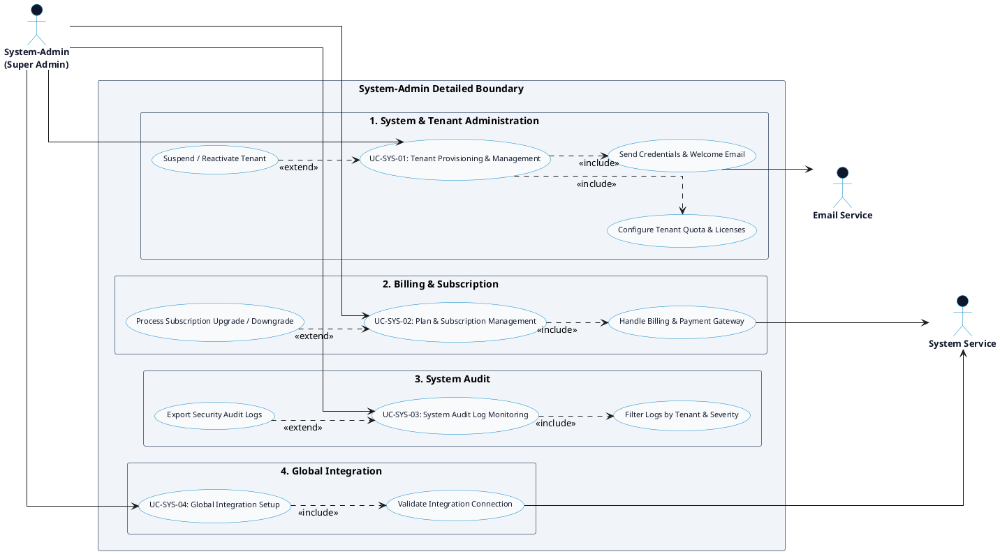

# HR MANAGEMENT PLATFORM - SYSTEM-ADMIN DETAILED USE CASE DIAGRAM

This document contains the **PlantUML** code and diagram for the **System-Admin Detailed Use Case Diagram** of the HR Management Platform, synchronized with [`ListUsecase.md`](file:///d:/Monitoring_HR/docs/usecase_diagram/ListUsecase.md).

---

## PlantUML Source Code

