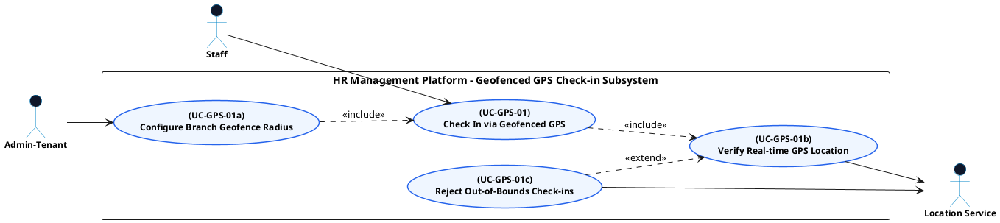

# GPS ATTENDANCE - GEOFENCED CHECK-IN USE CASE DIAGRAM

This document contains the **PlantUML** code and diagram for **Checking In via Geofenced GPS & Configuring Branch Radius** within the GPS Attendance subsystem, formatted for Draw.io (Left Primary Actors | Center Boundary | Right Secondary Actors).

---

## PlantUML Source Code

