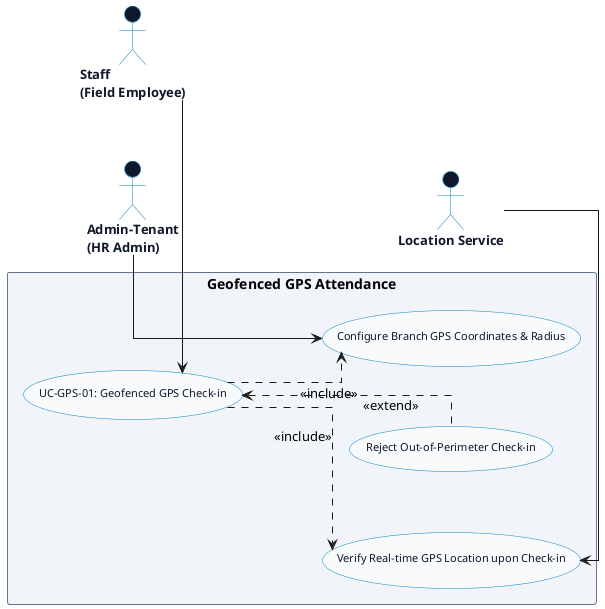

# GPS ATTENDANCE - GEOFENCED CHECK-IN DETAILED USE CASE DIAGRAM

Tài liệu này chứa mã **PlantUML** sơ đồ Use Case chi tiết cho tính năng **Geofenced GPS Check-in (Chấm công ranh giới GPS)** thuộc phân hệ GPS Attendance.

---

## PlantUML Source Code

