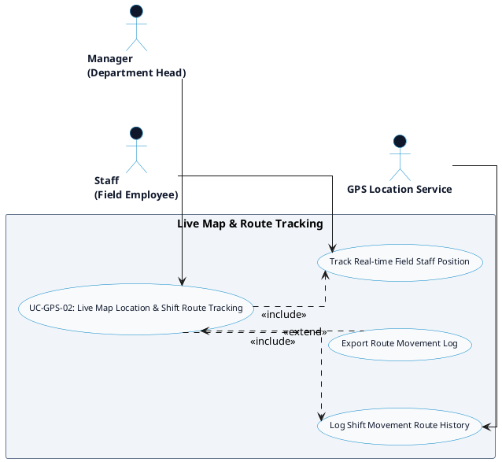

# GPS ATTENDANCE - LIVE MAP & ROUTE TRACKING DETAILED USE CASE DIAGRAM

Tài liệu này chứa mã **PlantUML** sơ đồ Use Case chi tiết cho tính năng **Live Map Location & Shift Route Tracking (Bản đồ Live Map & Lịch sử Lộ trình)** thuộc phân hệ GPS Attendance.

---

## PlantUML Source Code

