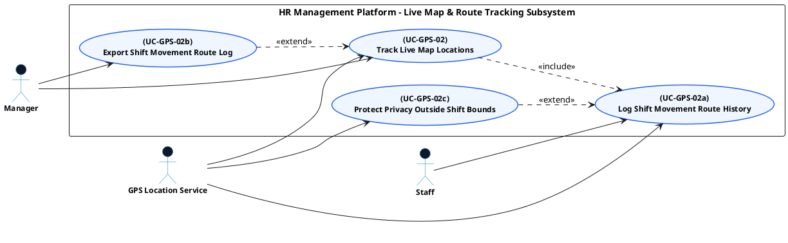

# GPS ATTENDANCE - LIVE MAP & ROUTE TRACKING USE CASE DIAGRAM

This document contains the **PlantUML** code and diagram for **Tracking Live Map Locations & Logging Shift Movement Routes** within the GPS Attendance subsystem, compatible with Draw.io.

---

## PlantUML Source Code

