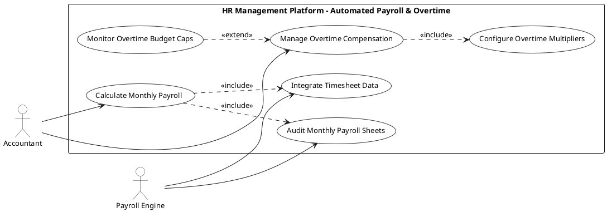

# PAYROLL & CLIENT INVOICING - AUTOMATED PAYROLL USE CASE DIAGRAM

This document contains the **PlantUML** code and diagram for **HR Management Platform - Automated Payroll & Overtime** within the Payroll & Client Invoicing subsystem.

---

## PlantUML Source Code

