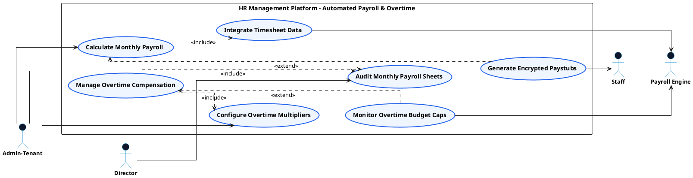

# PAYROLL & CLIENT INVOICING - AUTOMATED PAYROLL USE CASE DIAGRAM

This document contains the **PlantUML** code and diagram for **Calculating Automated Monthly Salaries & Managing Overtime Rules** within the Payroll & Client Invoicing subsystem, formatted for Draw.io with active verb high-level Use Cases, non-overlapping orthogonal arrows, and external Actors.

---

## PlantUML Source Code

