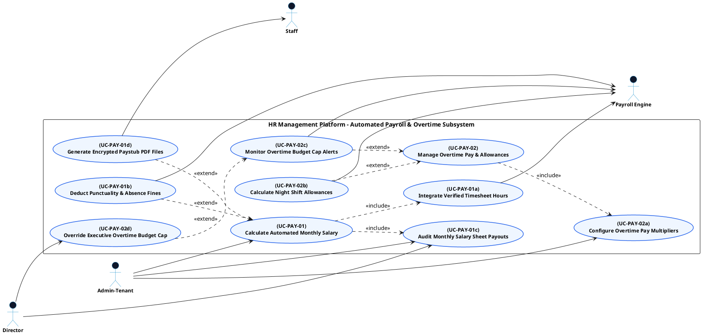

# PAYROLL & CLIENT INVOICING - AUTOMATED PAYROLL USE CASE DIAGRAM

This document contains the **PlantUML** code and diagram for **Calculating Automated Monthly Salaries & Managing Overtime Rules** within the Payroll & Client Invoicing subsystem, formatted for Draw.io (Left Primary Actors | Center Boundary | Right Secondary Actors).

---

## PlantUML Source Code

