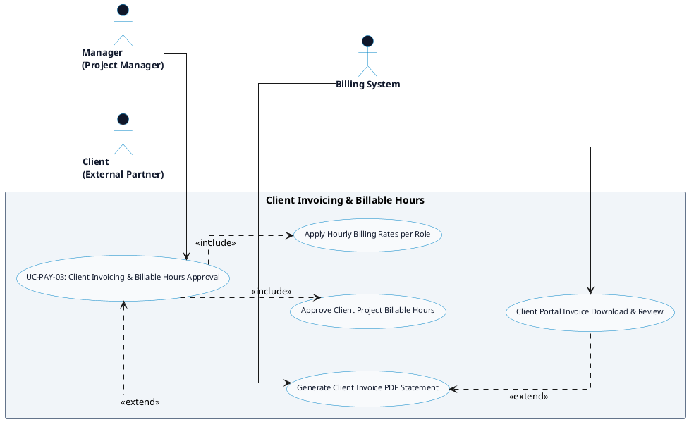

# PAYROLL & CLIENT INVOICING - CLIENT INVOICING & BILLABLE HOURS DETAILED USE CASE DIAGRAM

Tài liệu này chứa mã **PlantUML** sơ đồ Use Case chi tiết cho tính năng **Client Invoicing & Billable Hours Approval (Xuất hóa đơn Khách hàng & Phê duyệt Giờ tính phí)** thuộc phân hệ Payroll & Client Invoicing.

---

## PlantUML Source Code

