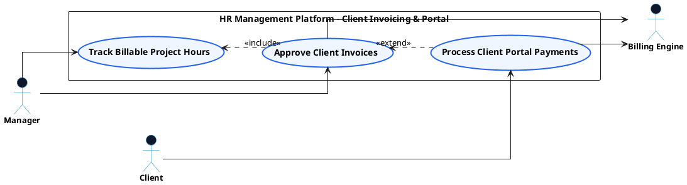

# PAYROLL & CLIENT INVOICING - CLIENT INVOICING & PORTAL USE CASE DIAGRAM

This document contains the **PlantUML** code and diagram for **Approving Client Invoices & Processing Payments via Client Portal** within the Payroll & Client Invoicing subsystem, formatted for Draw.io with active verb high-level Use Cases, non-overlapping orthogonal arrows, and external Actors.

---

## PlantUML Source Code

