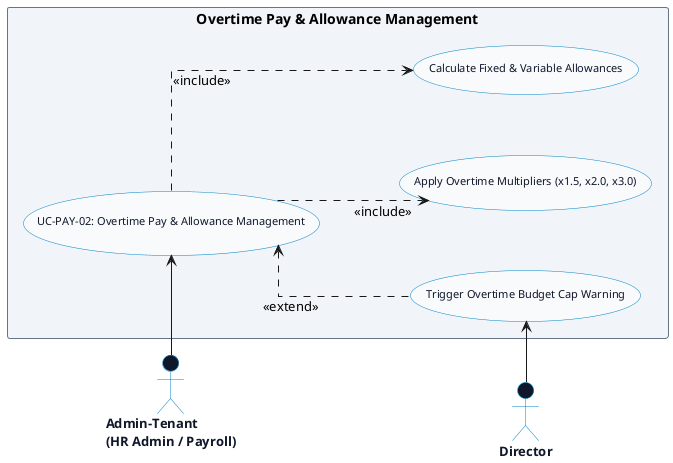

# PAYROLL & CLIENT INVOICING - OVERTIME PAY & ALLOWANCES DETAILED USE CASE DIAGRAM

Tài liệu này chứa mã **PlantUML** sơ đồ Use Case chi tiết cho tính năng **Overtime Pay & Allowance Management (Tính lương tăng ca & Phụ cấp)** thuộc phân hệ Payroll & Client Invoicing.

---

## PlantUML Source Code

