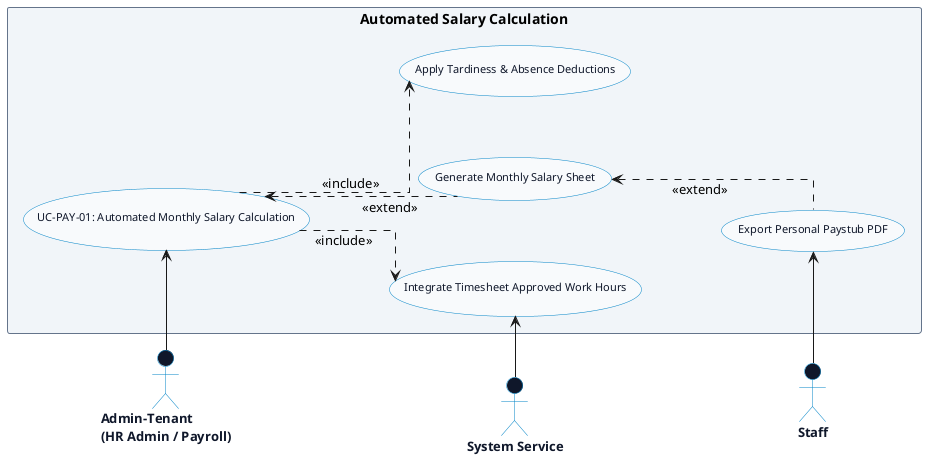

# PAYROLL & CLIENT INVOICING - AUTOMATED SALARY CALCULATION DETAILED USE CASE DIAGRAM

Tài liệu này chứa mã **PlantUML** sơ đồ Use Case chi tiết cho tính năng **Automated Monthly Salary Calculation (Tính lương tự động hàng tháng)** thuộc phân hệ Payroll & Client Invoicing.

---

## PlantUML Source Code

