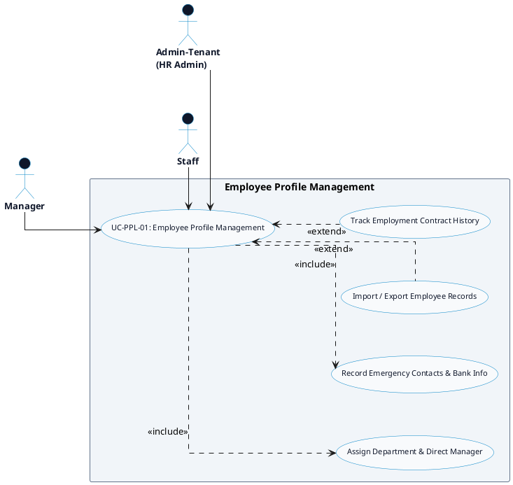

# PEOPLE MANAGEMENT - EMPLOYEE PROFILES DETAILED USE CASE DIAGRAM

Tài liệu này chứa mã **PlantUML** sơ đồ Use Case chi tiết cho tính năng **Employee Profile Management (Quản lý Hồ sơ Nhân sự)** thuộc phân hệ People Management.

---

## PlantUML Source Code

