# PEOPLE MANAGEMENT - LIFECYCLE & RBAC USE CASE DIAGRAM

This document contains the **PlantUML** code and diagram for **Executing Onboarding/Offboarding Workflows & Managing RBAC Roles** within the People Management subsystem, formatted for Draw.io with active verb high-level Use Cases, non-overlapping orthogonal arrows, and external Actors.

---

## PlantUML Source Code

```plantuml
@startuml
left to right direction
skinparam packageStyle rectangle
skinparam backgroundColor #ffffff
skinparam shadowing false
skinparam actorStyle stickman
skinparam linetype ortho

skinparam usecase {
  BackgroundColor #EFF6FF
  BorderColor #2563EB
  BorderThickness 2
  FontSize 14
  FontStyle bold
  FontName "Segoe UI"
}

skinparam actor {
  BackgroundColor #0F172A
  BorderColor #0284C7
  FontSize 13
  FontStyle bold
  FontName "Segoe UI"
}

' =====================================================
' PRIMARY ACTORS (OUTSIDE BOUNDARY - LEFT SIDE)
' =====================================================
actor "Admin-Tenant" as ADMIN
actor "System-Admin" as SYSADMIN

ADMIN -[hidden]down-> SYSADMIN

' =====================================================
' SYSTEM BOUNDARY & ALIGNED USE CASES (CENTER)
' =====================================================
rectangle "HR Management Platform - Lifecycle & RBAC" {
    
    ' High-Level Lifecycle Group
    usecase "Execute Employee Onboarding" as UC_PPL03
    usecase "Track Equipment Handover" as UC_PPL03A
    usecase "Process Employee Offboarding" as UC_PPL03B

    UC_PPL03 -[hidden]down-> UC_PPL03A
    UC_PPL03A -[hidden]down-> UC_PPL03B

    ' High-Level RBAC Group
    usecase "Manage Roles & Permissions" as UC_PPL04
    usecase "Configure Custom Role Groups" as UC_PPL04A

    UC_PPL04 -[hidden]down-> UC_PPL04A
}

' =====================================================
' SECONDARY ACTORS (OUTSIDE BOUNDARY - RIGHT SIDE)
' =====================================================
actor "Manager" as MGR
actor "Staff" as EMP

MGR -[hidden]down-> EMP

' =====================================================
' NON-OVERLAPPING ACTOR CONNECTIONS
' =====================================================
ADMIN --> UC_PPL03
ADMIN --> UC_PPL04

SYSADMIN --> UC_PPL04

UC_PPL03 --> MGR
UC_PPL03B --> MGR
UC_PPL03A --> EMP

' =====================================================
' INCLUDE & EXTEND RELATIONSHIPS
' =====================================================
UC_PPL03 ..> UC_PPL03A : <<include>>
UC_PPL03 ..> UC_PPL03B : <<include>>

UC_PPL04A ..> UC_PPL04 : <<extend>>

@endl
```

