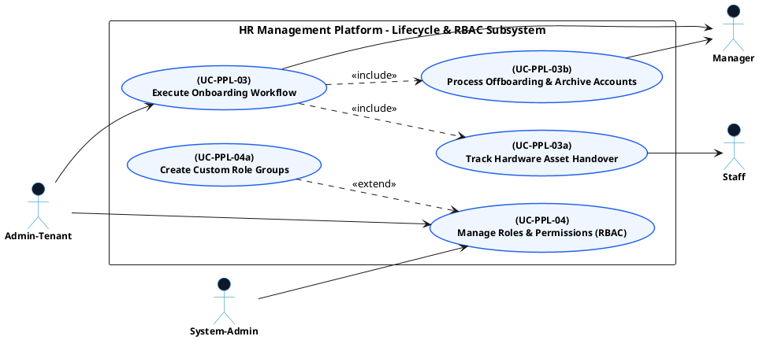

# PEOPLE MANAGEMENT - LIFECYCLE & RBAC USE CASE DIAGRAM

This document contains the **PlantUML** code and diagram for **Executing Onboarding/Offboarding Workflows & Managing RBAC Roles** within the People Management subsystem, formatted for Draw.io (Left Primary Actors | Center Boundary | Right Secondary Actors).

---

## PlantUML Source Code

