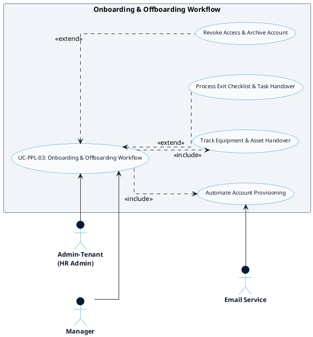

# PEOPLE MANAGEMENT - ONBOARDING & OFFBOARDING DETAILED USE CASE DIAGRAM

Tài liệu này chứa mã **PlantUML** sơ đồ Use Case chi tiết cho tính năng **Onboarding & Offboarding Workflow (Quy trình Tiếp nhận & Thôi việc)** thuộc phân hệ People Management.

---

## PlantUML Source Code

