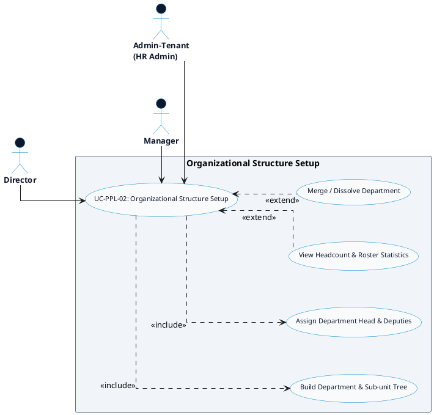

# PEOPLE MANAGEMENT - ORG STRUCTURE DETAILED USE CASE DIAGRAM

Tài liệu này chứa mã **PlantUML** sơ đồ Use Case chi tiết cho tính năng **Organizational Structure Setup (Cơ cấu Tổ chức & Phòng ban)** thuộc phân hệ People Management.

---

## PlantUML Source Code

