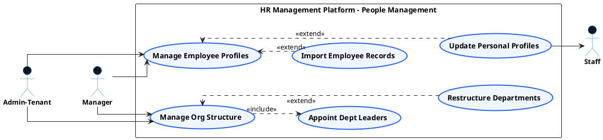

# PEOPLE MANAGEMENT - EMPLOYEE PROFILES & ORG STRUCTURE USE CASE DIAGRAM

This document contains the **PlantUML** code and diagram for **Managing Employee Profiles & Setting Up Organizational Structure** within the People Management subsystem, formatted for Draw.io with active verb high-level Use Cases, non-overlapping orthogonal arrows, and external Actors.

---

## PlantUML Source Code

