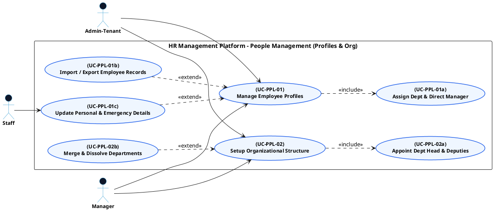

# PEOPLE MANAGEMENT - EMPLOYEE PROFILES & ORG STRUCTURE USE CASE DIAGRAM

This document contains the **PlantUML** code and diagram for **Managing Employee Profiles & Setting Up Organizational Structure** within the People Management subsystem, compatible with Draw.io.

---

## PlantUML Source Code

