# PEOPLE MANAGEMENT - RECRUITMENT & ATS USE CASE DIAGRAM

This document contains the **PlantUML** code and diagram for **Managing Job Openings, Tracking Candidate Pipelines, Scheduling Interviews & Issuing Offer Letters** within the People Management subsystem, formatted for Draw.io with active verb high-level Use Cases, non-overlapping orthogonal arrows, and external Actors.

---

## PlantUML Source Code

```plantuml
@startuml
left to right direction
skinparam packageStyle rectangle
skinparam backgroundColor #ffffff
skinparam shadowing false
skinparam actorStyle stickman
skinparam linetype ortho

skinparam usecase {
  BackgroundColor #EFF6FF
  BorderColor #2563EB
  BorderThickness 2
  FontSize 14
  FontStyle bold
  FontName "Segoe UI"
}

skinparam actor {
  BackgroundColor #0F172A
  BorderColor #0284C7
  FontSize 13
  FontStyle bold
  FontName "Segoe UI"
}

' =====================================================
' PRIMARY ACTORS (OUTSIDE BOUNDARY - LEFT SIDE)
' =====================================================
actor "Admin-Tenant" as ADMIN
actor "Manager" as MGR

ADMIN -[hidden]down-> MGR

' =====================================================
' SYSTEM BOUNDARY & ALIGNED USE CASES (CENTER)
' =====================================================
rectangle "HR Management Platform - Recruitment & ATS" {
    
    ' High-Level Job Openings Group
    usecase "Manage Job Openings" as UC_PPL05
    usecase "Track Candidate Pipeline" as UC_PPL05A
    usecase "Schedule Candidate Interviews" as UC_PPL05B
    usecase "Issue Digital Offer Letters" as UC_PPL05C

    UC_PPL05 -[hidden]down-> UC_PPL05A
    UC_PPL05A -[hidden]down-> UC_PPL05B
    UC_PPL05B -[hidden]down-> UC_PPL05C
}

' =====================================================
' SECONDARY ACTORS (OUTSIDE BOUNDARY - RIGHT SIDE)
' =====================================================
actor "Candidate" as CANDIDATE
actor "Email Service" as MAIL_SVC

CANDIDATE -[hidden]down-> MAIL_SVC

' =====================================================
' NON-OVERLAPPING ACTOR CONNECTIONS
' =====================================================
ADMIN --> UC_PPL05
MGR --> UC_PPL05
MGR --> UC_PPL05A
MGR --> UC_PPL05B
MGR --> UC_PPL05C

UC_PPL05A --> CANDIDATE
UC_PPL05C --> MAIL_SVC

' =====================================================
' INCLUDE & EXTEND RELATIONSHIPS
' =====================================================
UC_PPL05 ..> UC_PPL05A : <<include>>
UC_PPL05B ..> UC_PPL05A : <<extend>>
UC_PPL05C ..> UC_PPL05A : <<extend>>

@endl
```

