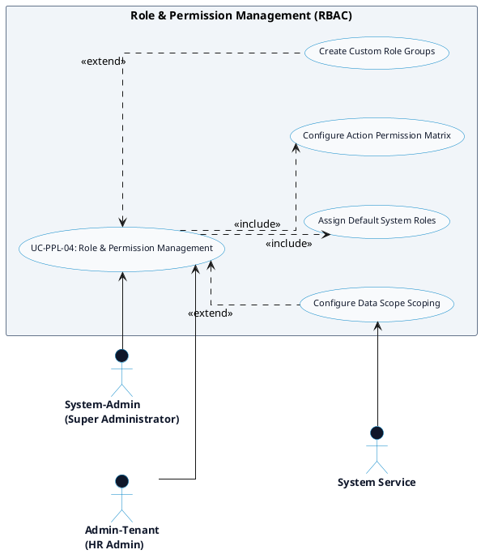

# PEOPLE MANAGEMENT - ROLES & PERMISSIONS DETAILED USE CASE DIAGRAM

Tài liệu này chứa mã **PlantUML** sơ đồ Use Case chi tiết cho tính năng **Role & Permission Management (Phân quyền Vai trò RBAC)** thuộc phân hệ People Management.

---

## PlantUML Source Code

