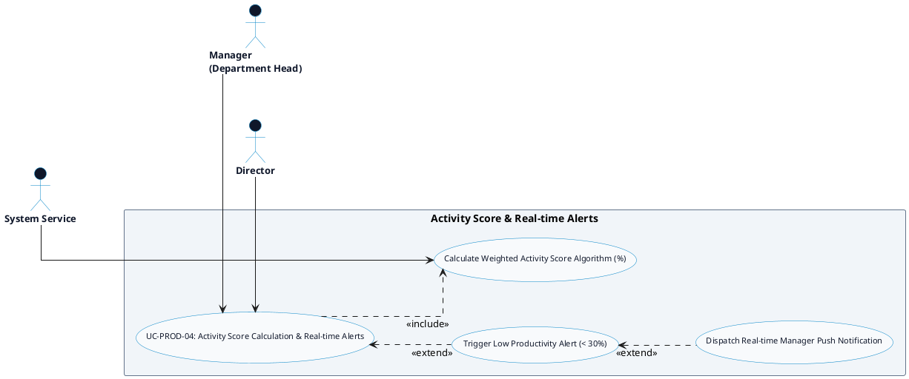

# PRODUCTIVITY MONITORING - ACTIVITY SCORE & ALERTS DETAILED USE CASE DIAGRAM

Tài liệu này chứa mã **PlantUML** sơ đồ Use Case chi tiết cho tính năng **Activity Score & Real-time Alerts (Điểm Hiệu suất & Cảnh báo thời gian thực)** thuộc phân hệ Productivity Monitoring.

---

## PlantUML Source Code

