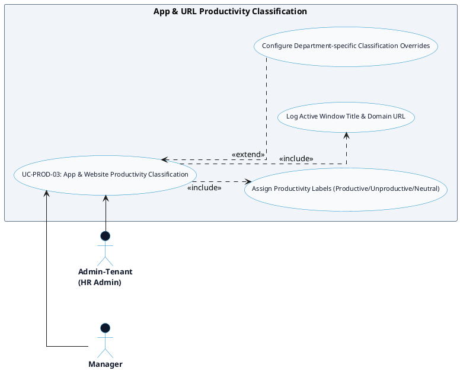

# PRODUCTIVITY MONITORING - APP & URL CLASSIFICATION DETAILED USE CASE DIAGRAM

Tài liệu này chứa mã **PlantUML** sơ đồ Use Case chi tiết cho tính năng **App & URL Productivity Classification (Phân loại Ứng dụng & Trang web)** thuộc phân hệ Productivity Monitoring.

---

## PlantUML Source Code

