# PRODUCTIVITY MONITORING - APP & WEB CLASSIFICATION USE CASE DIAGRAM

This document contains the **PlantUML** code and diagram for **Classifying App & Website Productivity & Configuring Department Rules** within the Productivity Monitoring subsystem, formatted for Draw.io with active verb high-level Use Cases, non-overlapping orthogonal arrows, and external Actors.

---

## PlantUML Source Code

```plantuml
@startuml
left to right direction
skinparam packageStyle rectangle
skinparam backgroundColor #ffffff
skinparam shadowing false
skinparam actorStyle stickman
skinparam linetype ortho

skinparam usecase {
  BackgroundColor #EFF6FF
  BorderColor #2563EB
  BorderThickness 2
  FontSize 14
  FontStyle bold
  FontName "Segoe UI"
}

skinparam actor {
  BackgroundColor #0F172A
  BorderColor #0284C7
  FontSize 13
  FontStyle bold
  FontName "Segoe UI"
}

' =====================================================
' PRIMARY ACTORS (OUTSIDE BOUNDARY - LEFT SIDE)
' =====================================================
actor "Admin-Tenant" as ADMIN
actor "Manager" as MGR

ADMIN -[hidden]down-> MGR

' =====================================================
' SYSTEM BOUNDARY & ALIGNED USE CASES (CENTER)
' =====================================================
rectangle "HR Management Platform - App & Web Classification" {
    
    usecase "Classify Productivity Apps & Web" as UC_PROD03
    usecase "Configure Classification Rules" as UC_PROD03A
    usecase "Override Department Rules" as UC_PROD03B
    usecase "Generate Usage Alerts" as UC_PROD03C

    UC_PROD03 -[hidden]down-> UC_PROD03A
    UC_PROD03A -[hidden]down-> UC_PROD03B
    UC_PROD03B -[hidden]down-> UC_PROD03C
}

' =====================================================
' SECONDARY ACTORS (OUTSIDE BOUNDARY - RIGHT SIDE)
' =====================================================
actor "Productivity AI Engine" as AI_ENGINE

' =====================================================
' NON-OVERLAPPING ACTOR CONNECTIONS
' =====================================================
ADMIN --> UC_PROD03
ADMIN --> UC_PROD03A
ADMIN --> UC_PROD03B

MGR --> UC_PROD03C

UC_PROD03C --> AI_ENGINE

' =====================================================
' INCLUDE & EXTEND RELATIONSHIPS
' =====================================================
UC_PROD03 ..> UC_PROD03A : <<include>>
UC_PROD03B ..> UC_PROD03A : <<extend>>
UC_PROD03C ..> UC_PROD03 : <<extend>>

@endl
```

