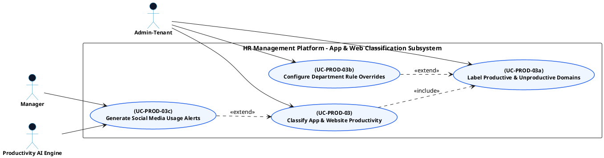

# PRODUCTIVITY MONITORING - APP & WEB CLASSIFICATION USE CASE DIAGRAM

This document contains the **PlantUML** code and diagram for **Classifying App & Website Productivity & Configuring Department Rules** within the Productivity Monitoring subsystem, compatible with Draw.io.

---

## PlantUML Source Code

