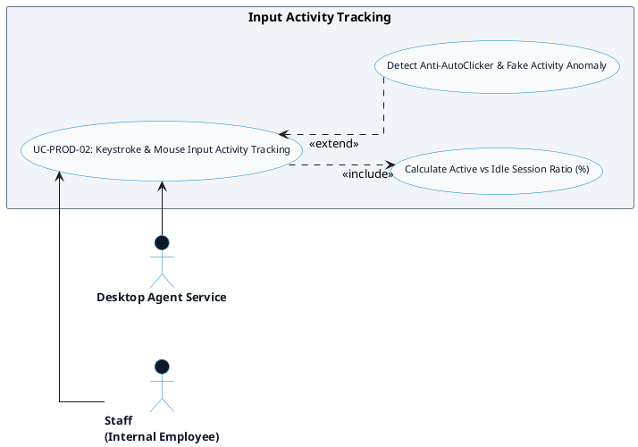

# PRODUCTIVITY MONITORING - INPUT ACTIVITY TRACKING DETAILED USE CASE DIAGRAM

Tài liệu này chứa mã **PlantUML** sơ đồ Use Case chi tiết cho tính năng **Input Activity Tracking (Theo dõi tương tác Phím & Chuột)** thuộc phân hệ Productivity Monitoring.

---

## PlantUML Source Code

