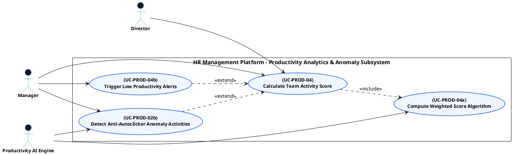

# PRODUCTIVITY MONITORING - SCORES & ANOMALY ALERTS USE CASE DIAGRAM

This document contains the **PlantUML** code and diagram for **Calculating Team Activity Scores & Triggering Anomaly Alerts** within the Productivity Monitoring subsystem, compatible with Draw.io.

---

## PlantUML Source Code

