# PRODUCTIVITY MONITORING - SCORES & ANOMALY ALERTS USE CASE DIAGRAM

This document contains the **PlantUML** code and diagram for **Calculating Team Activity Scores & Triggering Anomaly Alerts** within the Productivity Monitoring subsystem, formatted for Draw.io with active verb high-level Use Cases, non-overlapping orthogonal arrows, and external Actors.

---

## PlantUML Source Code

```plantuml
@startuml
left to right direction
skinparam packageStyle rectangle
skinparam backgroundColor #ffffff
skinparam shadowing false
skinparam actorStyle stickman
skinparam linetype ortho

skinparam usecase {
  BackgroundColor #EFF6FF
  BorderColor #2563EB
  BorderThickness 2
  FontSize 14
  FontStyle bold
  FontName "Segoe UI"
}

skinparam actor {
  BackgroundColor #0F172A
  BorderColor #0284C7
  FontSize 13
  FontStyle bold
  FontName "Segoe UI"
}

' =====================================================
' PRIMARY ACTORS (OUTSIDE BOUNDARY - LEFT SIDE)
' =====================================================
actor "Manager" as MGR
actor "Director" as DIR

MGR -[hidden]down-> DIR

' =====================================================
' SYSTEM BOUNDARY & ALIGNED USE CASES (CENTER)
' =====================================================
rectangle "HR Management Platform - Analytics & Anomaly Alerts" {
    
    usecase "Calculate Team Activity Scores" as UC_PROD04
    usecase "Render Productivity Dashboards" as UC_PROD04A
    usecase "Trigger Low Productivity Alerts" as UC_PROD04B
    usecase "Detect Anomaly Activities" as UC_PROD02B

    UC_PROD04 -[hidden]down-> UC_PROD04A
    UC_PROD04A -[hidden]down-> UC_PROD04B
    UC_PROD04B -[hidden]down-> UC_PROD02B
}

' =====================================================
' SECONDARY ACTORS (OUTSIDE BOUNDARY - RIGHT SIDE)
' =====================================================
actor "Productivity AI Engine" as AI_ENGINE

' =====================================================
' NON-OVERLAPPING ACTOR CONNECTIONS
' =====================================================
MGR --> UC_PROD04
DIR --> UC_PROD04

MGR --> UC_PROD04B
MGR --> UC_PROD02B

UC_PROD04A --> AI_ENGINE
UC_PROD02B --> AI_ENGINE

' =====================================================
' INCLUDE & EXTEND RELATIONSHIPS
' =====================================================
UC_PROD04 ..> UC_PROD04A : <<include>>
UC_PROD04B ..> UC_PROD04 : <<extend>>
UC_PROD02B ..> UC_PROD04 : <<extend>>

@endl
```

