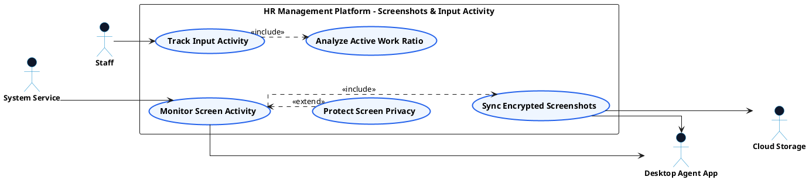

# PRODUCTIVITY MONITORING - SCREENSHOT & INPUT ACTIVITY USE CASE DIAGRAM

This document contains the **PlantUML** code and diagram for **Capturing Automated Screenshots & Tracking Input Activity** within the Productivity Monitoring subsystem, formatted for Draw.io with active verb high-level Use Cases, non-overlapping orthogonal arrows, and external Actors.

---

## PlantUML Source Code

