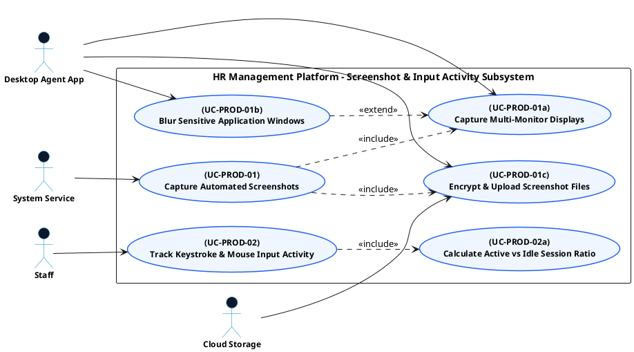

# PRODUCTIVITY MONITORING - SCREENSHOT & INPUT ACTIVITY USE CASE DIAGRAM

This document contains the **PlantUML** code and diagram for **Capturing Automated Screenshots & Tracking Input Activity** within the Productivity Monitoring subsystem, compatible with Draw.io.

---

## PlantUML Source Code

