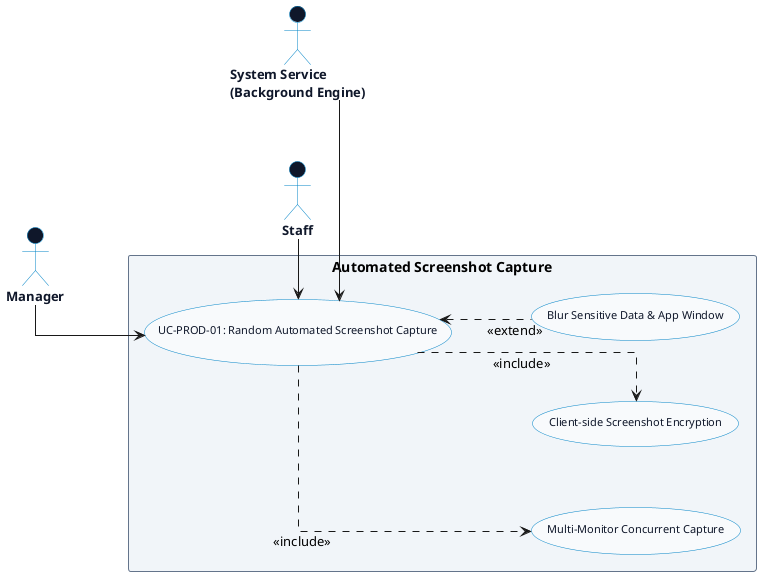

# PRODUCTIVITY MONITORING - AUTOMATED SCREENSHOT CAPTURE DETAILED USE CASE DIAGRAM

Tài liệu này chứa mã **PlantUML** sơ đồ Use Case chi tiết cho tính năng **Automated Screenshot Capture (Chụp màn hình ngẫu nhiên tự động)** thuộc phân hệ Productivity Monitoring.

---

## PlantUML Source Code

