# SCHEDULING & TIME-OFF - LEAVE MANAGEMENT USE CASE DIAGRAM

This document contains the **PlantUML** code and diagram for **Managing Time-Off Requests & Approving Multi-Level Leave** within the Scheduling & Time-Off subsystem, formatted for Draw.io with active verb high-level Use Cases, non-overlapping orthogonal arrows, and external Actors.

---

## PlantUML Source Code

```plantuml
@startuml
left to right direction
skinparam packageStyle rectangle
skinparam backgroundColor #ffffff
skinparam shadowing false
skinparam actorStyle stickman
skinparam linetype ortho

skinparam usecase {
  BackgroundColor #EFF6FF
  BorderColor #2563EB
  BorderThickness 2
  FontSize 14
  FontStyle bold
  FontName "Segoe UI"
}

skinparam actor {
  BackgroundColor #0F172A
  BorderColor #0284C7
  FontSize 13
  FontStyle bold
  FontName "Segoe UI"
}

' =====================================================
' PRIMARY ACTORS (OUTSIDE BOUNDARY - LEFT SIDE)
' =====================================================
actor "Staff" as EMP

' =====================================================
' SYSTEM BOUNDARY & ALIGNED USE CASES (CENTER)
' =====================================================
rectangle "HR Management Platform - Leave Management" {
    
    usecase "Submit Leave Requests" as UC_SCHED02
    usecase "Verify Available Leave Quota" as UC_SCHED02A
    usecase "Approve Multi-level Leave" as UC_SCHED02C

    UC_SCHED02 -[hidden]down-> UC_SCHED02A
    UC_SCHED02A -[hidden]down-> UC_SCHED02C
}

' =====================================================
' SECONDARY ACTORS (OUTSIDE BOUNDARY - RIGHT SIDE)
' =====================================================
actor "Manager" as MGR
actor "Admin-Tenant" as ADMIN
actor "Leave Service" as LEAVE_SVC

MGR -[hidden]down-> ADMIN
ADMIN -[hidden]down-> LEAVE_SVC

' =====================================================
' NON-OVERLAPPING ACTOR CONNECTIONS
' =====================================================
EMP --> UC_SCHED02

UC_SCHED02C --> MGR
UC_SCHED02C --> ADMIN
UC_SCHED02A --> LEAVE_SVC

' =====================================================
' INCLUDE & EXTEND RELATIONSHIPS
' =====================================================
UC_SCHED02 ..> UC_SCHED02A : <<include>>
UC_SCHED02 ..> UC_SCHED02C : <<include>>

@endl
```

