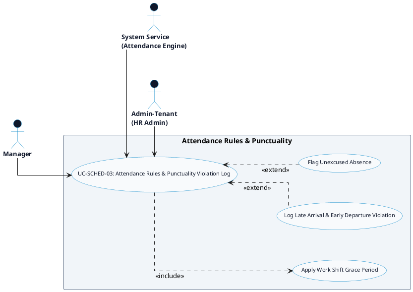

# SCHEDULING & TIME-OFF - ATTENDANCE RULES & PUNCTUALITY DETAILED USE CASE DIAGRAM

Tài liệu này chứa mã **PlantUML** sơ đồ Use Case chi tiết cho tính năng **Attendance Rules & Punctuality Violation Log (Quy tắc Chấm công & Ghi nhận Đi muộn/Về sớm)** thuộc phân hệ Scheduling & Time-Off.

---

## PlantUML Source Code

