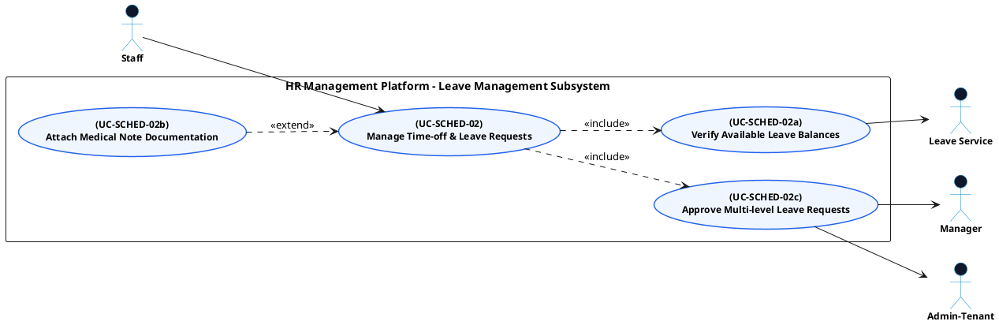

# SCHEDULING & TIME-OFF - LEAVE MANAGEMENT USE CASE DIAGRAM

This document contains the **PlantUML** code and diagram for **Managing Time-Off Requests & Approving Multi-Level Leave** within the Scheduling & Time-Off subsystem, formatted for Draw.io (Left Primary Actors | Center Boundary | Right Secondary Actors).

---

## PlantUML Source Code

