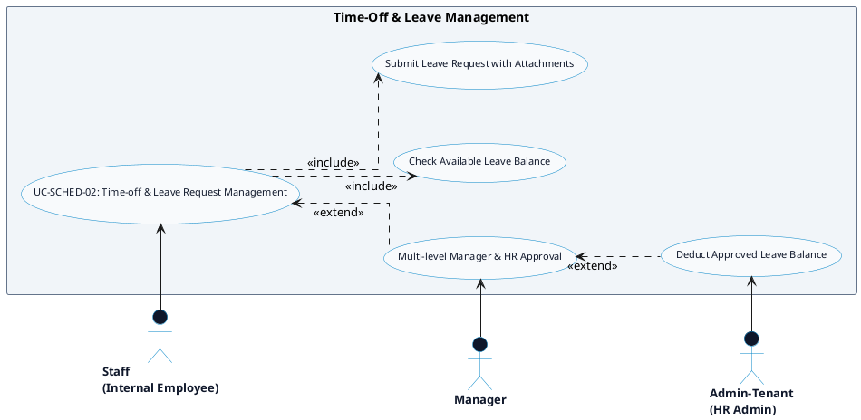

# SCHEDULING & TIME-OFF - TIME-OFF & LEAVE MANAGEMENT DETAILED USE CASE DIAGRAM

Tài liệu này chứa mã **PlantUML** sơ đồ Use Case chi tiết cho tính năng **Time-off & Leave Request Management (Quản lý Đăng ký Nghỉ phép)** thuộc phân hệ Scheduling & Time-Off.

---

## PlantUML Source Code

