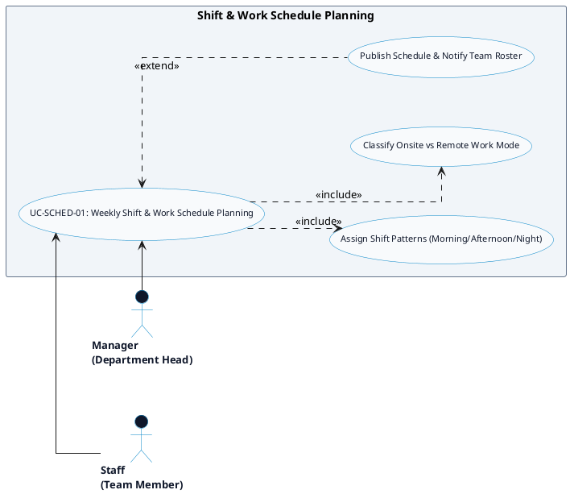

# SCHEDULING & TIME-OFF - WEEKLY SHIFT PLANNING DETAILED USE CASE DIAGRAM

Tài liệu này chứa mã **PlantUML** sơ đồ Use Case chi tiết cho tính năng **Weekly Shift & Work Schedule Planning (Lên lịch ca làm việc tuần)** thuộc phân hệ Scheduling & Time-Off.

---

## PlantUML Source Code

