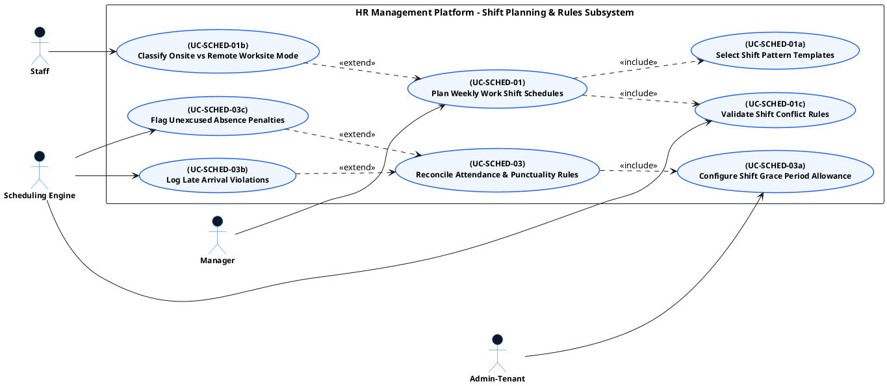

# SCHEDULING & TIME-OFF - SHIFT PLANNING & RULES USE CASE DIAGRAM

This document contains the **PlantUML** code and diagram for **Planning Weekly Work Shifts & Reconciling Attendance Rules** within the Scheduling & Time-Off subsystem, compatible with Draw.io.

---

## PlantUML Source Code

