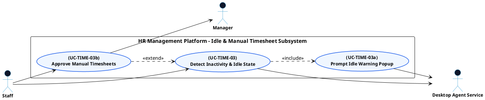

# TIME TRACKING - IDLE DETECTION & MANUAL TIMESHEETS USE CASE DIAGRAM

This document contains the **PlantUML** code and diagram for **Detecting Inactivity & Approving Manual Timesheets** within the Time Tracking subsystem, formatted for Draw.io (Left Primary Actors | Center Boundary | Right Secondary Actors).

---

## PlantUML Source Code

