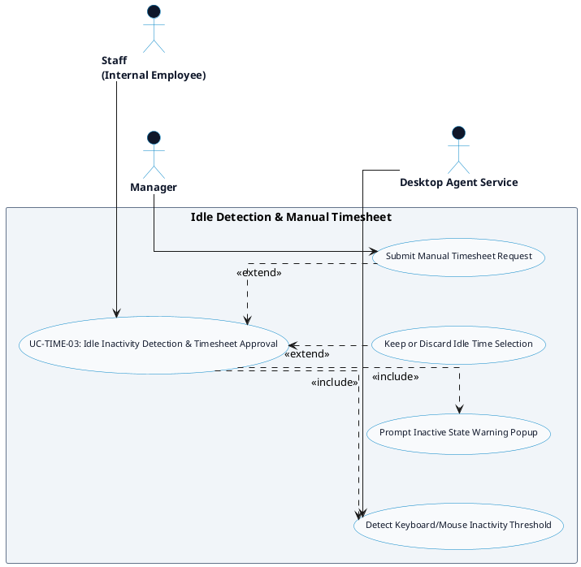

# TIME TRACKING - IDLE DETECTION & MANUAL TIMESHEET DETAILED USE CASE DIAGRAM

Tài liệu này chứa mã **PlantUML** sơ đồ Use Case chi tiết cho tính năng **Idle Detection & Manual Timesheet (Phát hiện Inactive & Timesheet Thủ công)** thuộc phân hệ Time Tracking.

---

## PlantUML Source Code

