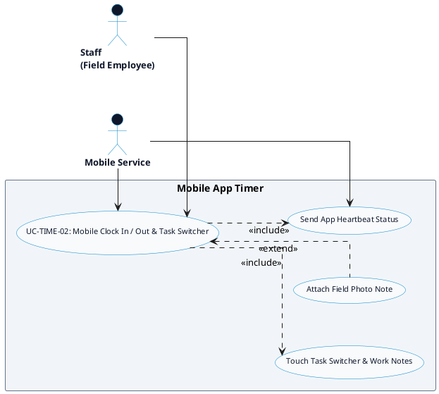

# TIME TRACKING - MOBILE APP TIMER DETAILED USE CASE DIAGRAM

Tài liệu này chứa mã **PlantUML** sơ đồ Use Case chi tiết cho tính năng **Mobile App Timer (Bộ đếm thời gian trên Mobile)** thuộc phân hệ Time Tracking.

---

## PlantUML Source Code

