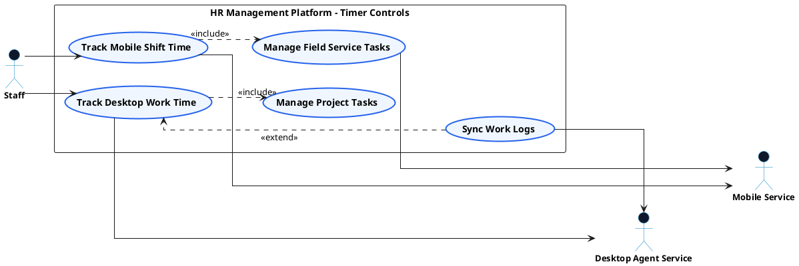

# TIME TRACKING - WORK TIMER CONTROLS USE CASE DIAGRAM

This document contains the **PlantUML** code and diagram for **Controlling Desktop & Mobile Work Timers** within the Time Tracking subsystem, formatted for Draw.io with active verb high-level Use Cases, non-overlapping orthogonal arrows, and external Actors.

---

## PlantUML Source Code

