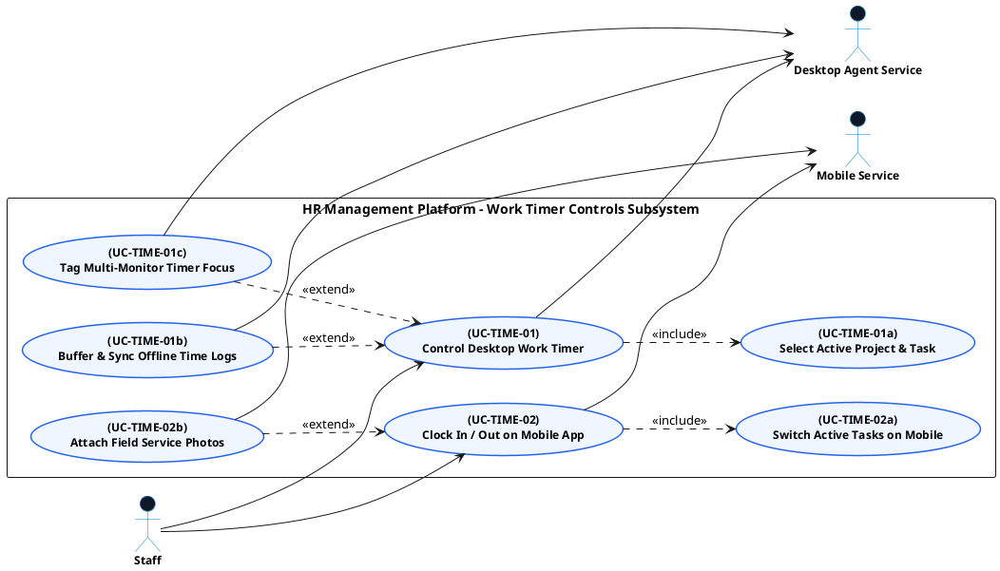

# TIME TRACKING - WORK TIMER CONTROLS USE CASE DIAGRAM

This document contains the **PlantUML** code and diagram for **Controlling Desktop & Mobile Work Timers** within the Time Tracking subsystem, formatted for Draw.io (Left Primary Actors | Center Boundary | Right Secondary Actors).

---

## PlantUML Source Code

